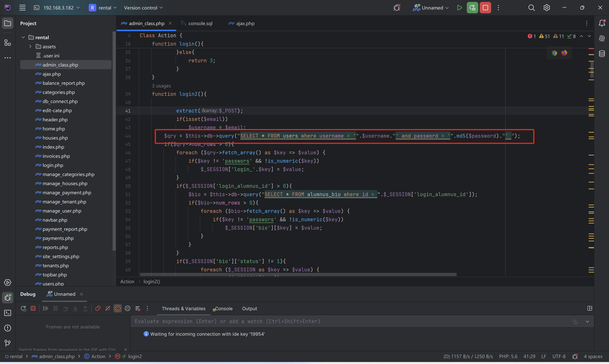
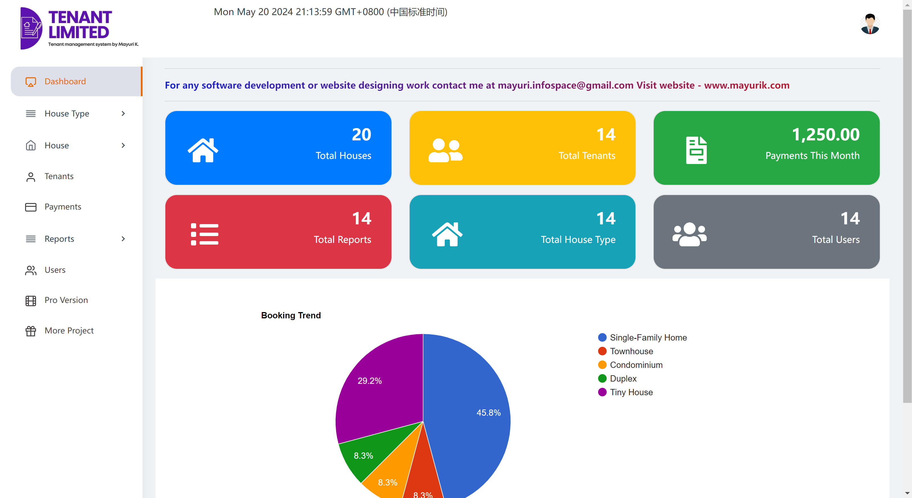

# Best house rental management system project in php - Universal password

The login logic in `admin_class.php`:

`$qry = $this->db->query("SELECT * FROM users where username = '".$username."' and password = '".md5($password)."' ");`

does not perform any filtering.

se `admin' or 1=1 -- asas` for the username and enter any password to log in.

