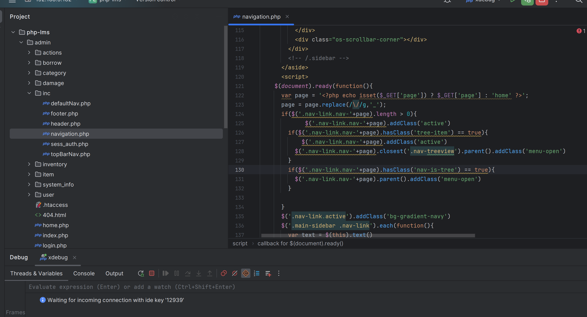
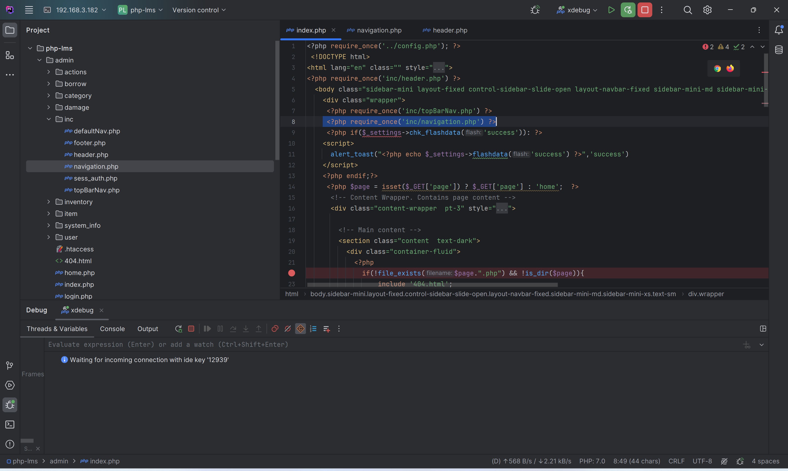
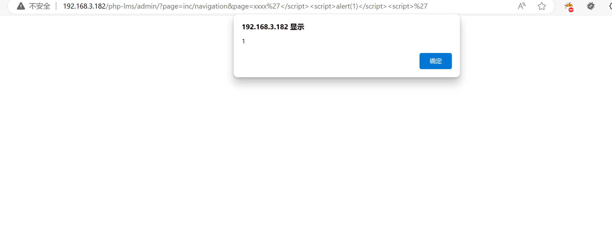

# Computer Laboratory Management System using PHP and MySQL - XSS

In *admin/inc/navigation.php*, it was found that there exists `<?php echo isset($_GET['page']) ? $_GET['page'] : 'home' ?>` which directly responds to the GET request parameter "`page`".

The *admin/index.php* page references *admin/inc/navigation.php*, so the homepage can be triggered directly.

payload

> <http://192.168.3.182/php-lms/admin&page=>**xxxx'\</script>\\<script>'**

