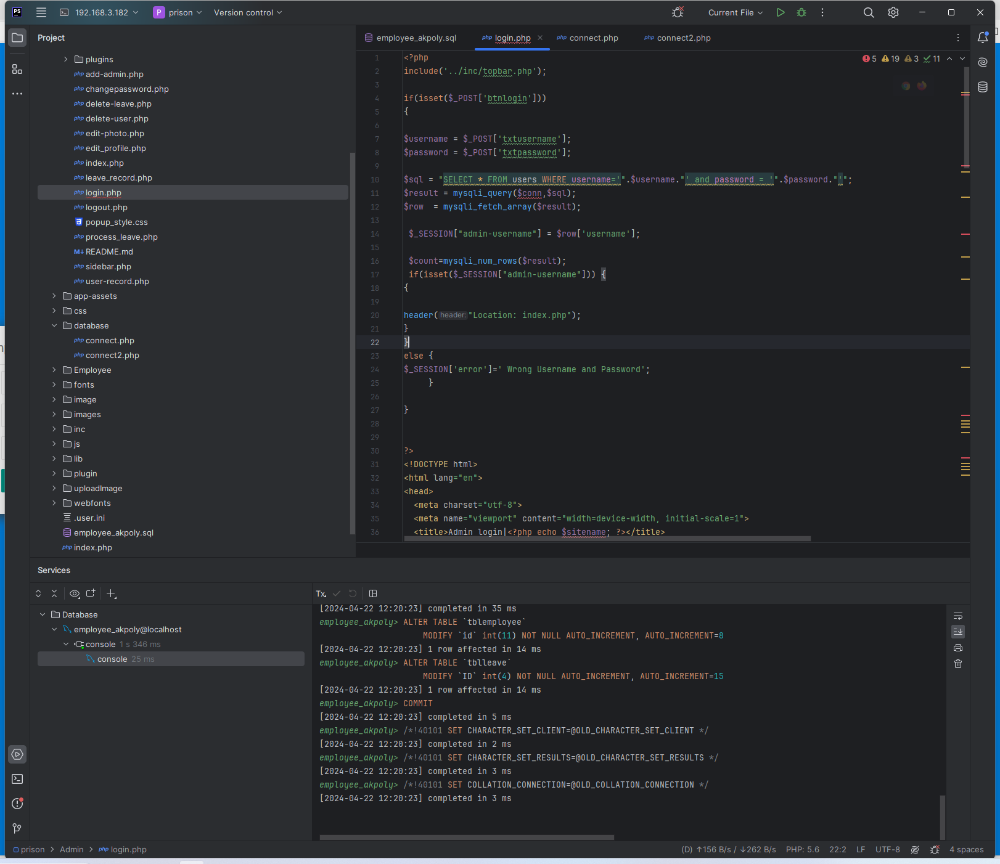
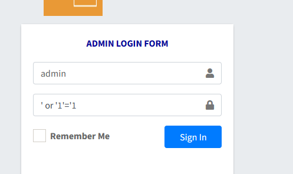
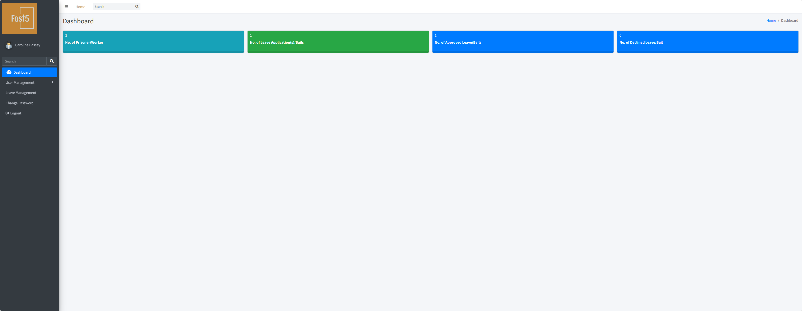

# Prison Management System Using PHP - Administrator - master password

The login logic in Admin/login.php doesn't perform any filtering. The SQL query is: "SELECT \* FROM users WHERE username='".\$username."' and password = '".\$password."'"

Entering ' or '1'='1 at the password field allows logging in.

