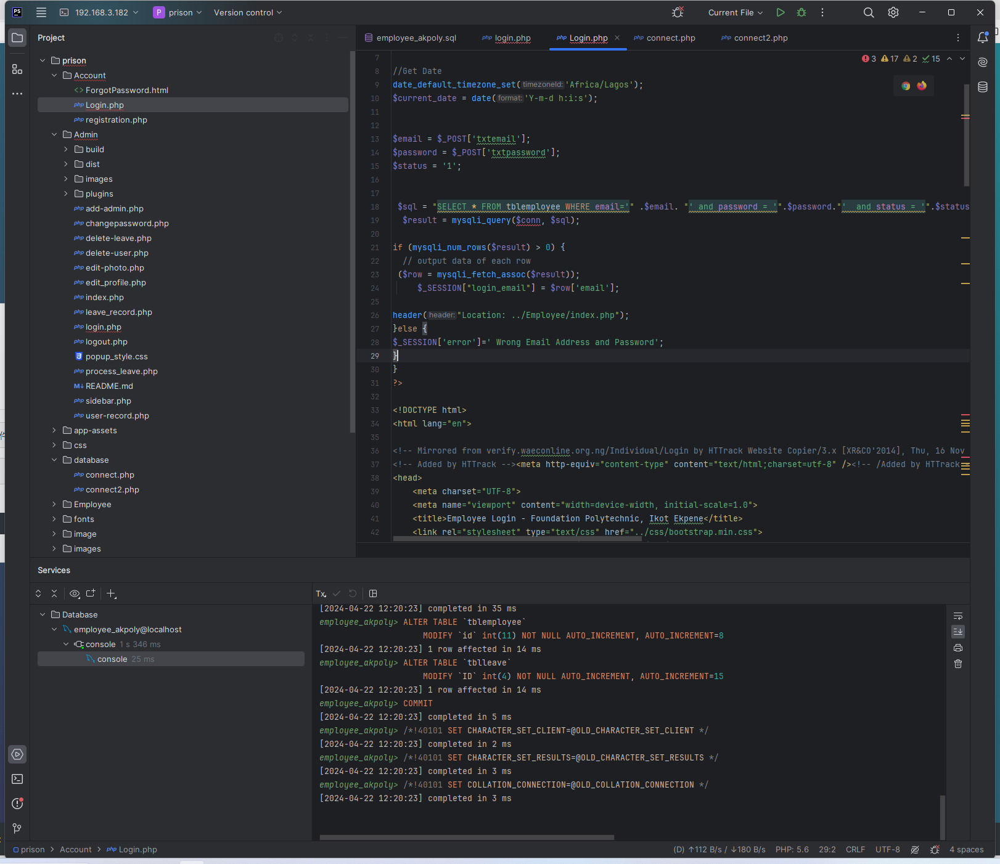
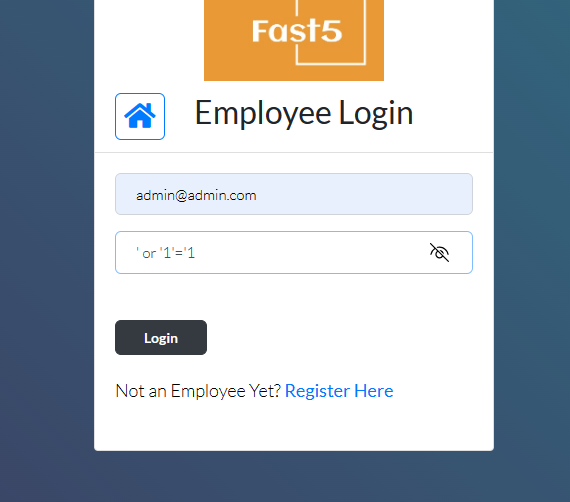
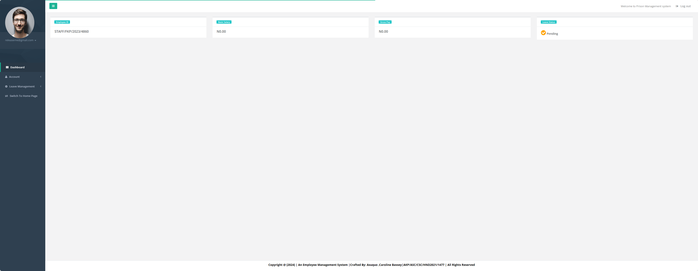

# Prison Management System Using PHP - Employee - master password

The login logic in Account/Login.php doesn't perform any filtering. The SQL query is: $sql= "SELECT * FROM tblemployee WHERE email='" .$email. "' and password = '".$password."'  and status = '".$status."'";

Entering ' or '1'='1 at the password field allows logging in.

